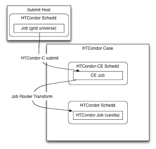
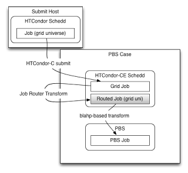

HTCondor-CE Overview
====================

About this Document
-------------------

This document serves as an introduction to HTCondor-CE, how it works, and how it differs from a GRAM CE.

Document Requirements
---------------------

Before continuing with this document, make sure that you are familiar with the following concepts:

-   An OSG site plan
    -   What is a batch system and which one will you use ([HTCondor](http://htcondor.org/), PBS, LSF, SGE, or SLURM)?
    -   Security in the OSG via [GSI](http://toolkit.globus.org/toolkit/docs/3.2/security.html) (i.e., [Certificate authorities](https://en.wikipedia.org/wiki/Certificate_authority), user and host [certificates](https://en.wikipedia.org/wiki/Public_key_certificate), proxies)
-   Pilot jobs, frontends, and factories (i.e., [GlideinWMS](http://glideinwms.fnal.gov/doc.prd/index.html), [AutoPyFactory](https://twiki.grid.iu.edu/bin/view/Documentation/Release3/AutoPyFactory))

What is a Compute Element?
--------------------------

An OSG Compute Element (CE) is the entry point for the OSG to your local resources: a layer of software that you install on a machine that can submit jobs into your local batch system. At the heart of the CE is the *job gateway* software, which is responsible for handling incoming jobs, authorizing them, and delegating them to your batch system for execution. Historically, the OSG only had one option for a job gateway solution, Globus Toolkit’s GRAM-based gatekeeper, but now offers the HTCondor-CE as an alternative.

Today in OSG, most jobs that arrive at a CE (called *grid jobs*) are **not** end-user jobs, but rather pilot jobs submitted from factories. Successful pilot jobs create and make available an environment for actual end-user jobs to match and ultimately run within the pilot job container. Eventually pilot jobs remove themselves, typically after a period of inactivity.

What is HTCondor-CE?
--------------------

HTCondor-CE is a special configuration of the HTCondor software designed to be a job gateway solution for the OSG. It is configured to use the [JobRouter daemon](http://research.cs.wisc.edu/htcondor/manual/v8.6/5_4HTCondor_Job.html) to delegate jobs by transforming and submitting them to the site’s batch system.

### How is HTCondor-CE different from a GRAM CE?

The biggest difference you will see between an HTCondor-CE and a GRAM CE is in the way that jobs are submitted to your batch system; HTCondor-CE uses the built-in JobRouter daemon whereas GRAM CE uses jobmanager scripts written in Perl. Customizing your site’s CE now requires editing configuration files instead of editing jobmanager scripts.

Listed below are some other benefits to switching to HTCondor-CE:

-   **Scalability:** HTCondor-CE is capable of supporting job workloads of large sites (see [scale testing results](https://twiki.opensciencegrid.org/bin/view/Documentation/Release3/HTCondorCEScaleTests))
-   **Debugging tools:** HTCondor-CE offers [many tools to help troubleshoot](https://twiki.opensciencegrid.org/bin/view/Documentation/Release3/TroubleshootingHTCondorCE) issues with jobs
-   **Routing as configuration:** HTCondor-CE’s mechanism to transform and submit jobs is customized via configuration variables, which means that customizations will persist across upgrades and will not involve modification of software internals to route jobs

How Jobs Run
------------

Once an incoming grid job is authorized, it is placed into HTCondor-CE’s scheduler where the JobRouter creates a transformed copy (called the *routed job*) and submits the copy to the batch system (called the *batch system job*). After submission, HTCondor-CE monitors the batch system job and communicates its status to the original grid job, which in turn notifies the original submitter (e.g., job factory) of any updates. When the job completes, files are transferred along the same chain: from the batch system to the CE, then from the CE to the original submitter.

### On HTCondor batch systems

For a site with an HTCondor **batch system**, the JobRouter can use HTCondor protocols to place a transformed copy of the grid job directly into the batch system’s scheduler, meaning that the routed and batch system jobs are one and the same. Thus, there are three representations of your job, each with its own ID (see diagram below):

-   Submit host: the HTCondor job ID in the original queue
-   HTCondor-CE: the grid job’s ID
-   HTCondor batch system: the routed job’s ID

In an HTCondor-CE/HTCondor setup, files are transferred from HTCondor-CE’s spool directory to the batch system’s spool directory using internal HTCondor protocols.

!!! note 
    The JobRouter copies the job directly into the batch system and does not make use of `condor_submit`. This means that if the HTCondor batch system is configured to add attributes to incoming jobs when they are submitted (i.e., `SUBMIT_EXPRS`), these attributes will not be added to the routed jobs.

### On other batch systems

For non-HTCondor batch systems, the JobRouter transforms the grid job into a routed job on the CE and the routed job submits a job into the batch system via a process called the BLAHP. Thus, there are four representations of your job, each with its own ID (see diagram below):

-   Submit host: the HTCondor job ID in the original queue
-   HTCondor-CE: the grid job’s ID and the routed job’s ID
-   HTCondor batch system: the batch system’s job ID

Although the following figure specifies the PBS case, it applies to all non-HTCondor batch systems:

With non-HTCondor batch systems, HTCondor-CE cannot use internal HTCondor protocols to transfer files so its spool directory must be exported to a shared file system that is mounted on the batch system’s worker nodes.

### Over SSH

[HTCondor-CE-Bosco](https://twiki.grid.iu.edu/bin/view/Documentation/Release3/InstallHTCondorBosco) is a special configuration of HTCondor-CE that can submit jobs to a remote cluster over SSH. The HTCondor-CE-Bosco provides a simple starting point for opportunistic resource owners that want to start contributing to the OSG with minimal effort: an organization will be able to accept OSG jobs by allowing SSH access to a submit node in their cluster.

HTCondor-CE-Bosco is intended for small sites or as an introduction to the OSG. If your site intends to run thousands of OSG jobs, you will need to host a standard [HTCondor-CE](https://twiki.grid.iu.edu/bin/view/Documentation/Release3/InstallHTCondorCE) because HTCondor-CE-Bosco has not yet been optimized for such loads.

How the CE is Customized
------------------------

Aside from the [basic configuration](https://twiki.grid.iu.edu/bin/view/Documentation/Release3/InstallHTCondorCE#Configuring_HTCondor_CE) required in the CE installation, there are two main ways to customize your CE (if you decide any customization is required at all):

-   **Deciding which VOs are allowed to run at your site:** The method of limiting the VOs that are allowed to run on your site has not changed between GRAM and HTCondor-CE’s: select an authorization system, GUMS or edg-mkgridmap, and configure it accordingly.
-   **How to filter and transform the grid jobs to be run on your batch system:** Filtering and transforming grid jobs (i.e., setting site-specific attributes or resource limits), requires configuration of your site’s job routes. For examples of common job routes, consult the [JobRouter recipes](https://twiki.grid.iu.edu/bin/view/Documentation/Release3/JobRouterRecipes) page.

!!! note
    If you are running HTCondor as your batch system, you will have two HTCondor configurations side-by-side (one residing in `/etc/condor/` and the other in `/etc/condor-ce`) and will need to make sure to differentiate the two when editing any configuration.

How Security Works
------------------

In the OSG, security depends on a PKI infrastructure involving Certificate Authorities (CAs) where CAs sign and issue certifcates to users and hosts. When these users and hosts wish to communicate with each other, the identities of each party is confirmed by cross-checking their certificates with the signing CA and establishing trust.

Due to the OSG's distributed nature, a user's job may end up at any number of sites, potentially needing to re-authenticate at multiple points. Instead of sending the user's certificate with the job for this re-authentication, trust can be delegated to a proxy that is generated from the user certificate, which is then attached to the job and expires after some set time for added security.

In its default configuration, HTCondor-CE uses GSI-based authentication and authorization (the same as Globus GRAM) to verify the certificate chain, which will work with existing GUMS servers or grid mapfiles. Additionally, it can be reconfigured to provide alternate authentication mechanisms such as Kerberos, SSL, shared secret, or even IP-based authentication. More information about authorization methods can be found [here](http://research.cs.wisc.edu/htcondor/manual/v8.2/3_6Security.html#SECTION00463000000000000000).

Next steps
----------

If you're transitioning from a GRAM CE to HTCondor-CE, the process is the same as if you were setting up a completely new CE, whether you're installing it on a new machine or alongside your GRAM CE.

-   Install [HTCondor-CE](https://twiki.grid.iu.edu/bin/view/Documentation/Release3/InstallHTCondorCE) or [HTCondor-CE-Bosco](https://twiki.grid.iu.edu/bin/view/Documentation/Release3/InstallHTCondorBosco)
-   Setting up [job routes](https://twiki.grid.iu.edu/bin/view/Documentation/Release3/JobRouterRecipes)
-   [Submitting](https://twiki.grid.iu.edu/bin/view/Documentation/Release3/SubmittingHTCondorCE) jobs to HTCondor-CE
-   [Troubleshooting](https://twiki.grid.iu.edu/bin/view/Documentation/Release3/TroubleshootingHTCondorCE) HTCondor-CE
-   Register the CE with OIM
-   Register with the OSG GlideinWMS factories and/or the ATLAS AutoPyFactory

