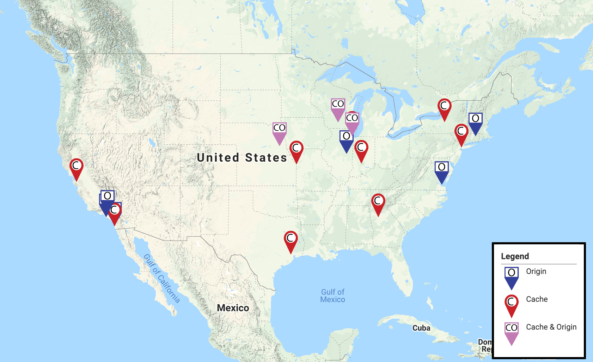
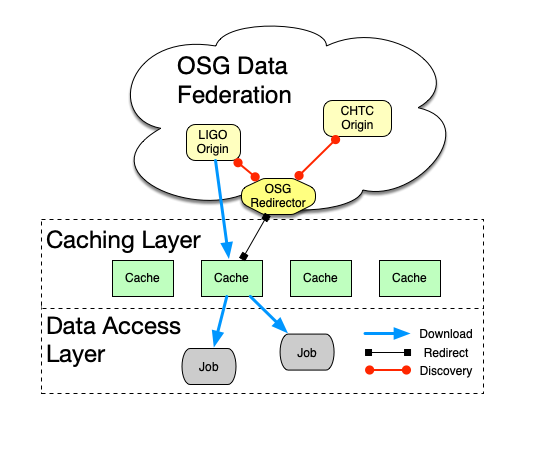

# Overview of StashCache

The OSG operates the _StashCache data federation_, a service that allows organizations to export their data utilizing
an _origin server_ and have the data streamed to end jobs from a distributed set of _cache servers_ throughout the US.
By participating in StashCache, organizations can distribute their data in a scalable manner to thousands of jobs without
needing to pre-place data across sites or operate their own scalable infrastructure.

The map below shows the location of the current caches in StashCache:

The StashCache federation consists of two service types:

* **Origin**: Authoritative copy data available to the caching servers.  The origin is only accessed when the Caches do not have the requested data.  The Origin is run and maintained by organizations wishing to distribute data within the StashCache federation.
* **Cache**: Clients request data from the cache server, which either serves it from local disk or fetches it from the origin.
The caches will store frequently used data on disk for future clients.  By distributing caches throughout the OSG and Internet2, clients 
can access their data with lower latency and higher throughput compared to accessing the origin directly.  A site may install their own
cache and make it available locally and /or to the wider user community.  A site-local cache can reduce the amount of data transferred
across the wide area network. 

OSG users access the data via the [stashcp](https://support.opensciencegrid.org/support/solutions/articles/12000002775-transferring-data-with-stashcach) client or from CVMFS.

The architecture of StashCache is illustrated below:

Jobs request data from the nearest discovered cache service.  If there is a cache miss, it will query the OSG redirectors for the
location of the data.  The redirectors query the known origin servers, which then report whether they have the data.  Once the redirector
determines the location, it will redirect the cache server to the appropriate origin.  Finally, the cache will download the data from
the origin and 

## Joining and Using StashCache

* Organizations can export their data to StashCache by [installing the StashCache **Origin**](install-origin.md)
* Sites can reduce data transfer via the WAN by [installing the StashCache **Cache**](install-cache.md)
* Users can access StashCache via the [stashcp](https://support.opensciencegrid.org/support/solutions/articles/12000002775-transferring-data-with-stashcach) client
